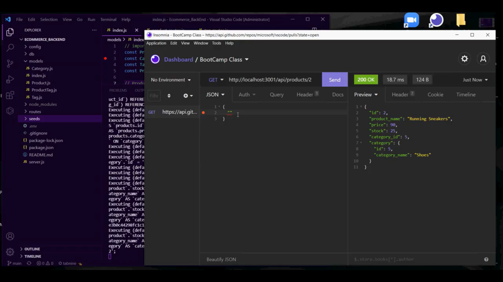

# Ecommerce_BackEnd
---
## Description
A SQL Database teminal profeam allowing the user to search, add, edit, and remove different categories, products, and tags related to inventory. Simple and easy interface allowing you to check get, push, put and delete from Insomina or other platform. 
---
### Links
Walkthrough Demo Video: https://drive.google.com/file/d/1PLADVpp4PeIUizW1pUngKXm43ion8Yqn/view?usp=sharing

GitHub Repository: https://github.com/Skylar-Harwell/Ecommerce_BackEnd 
---

